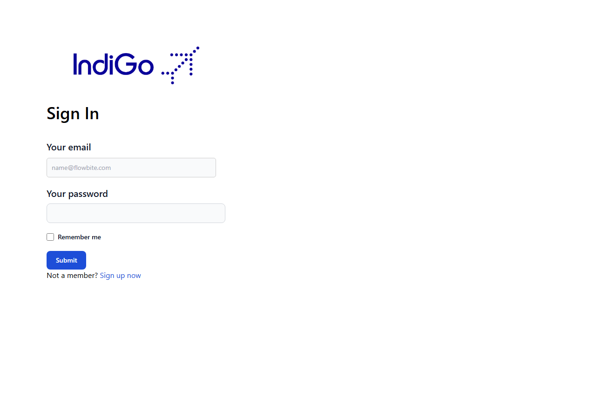
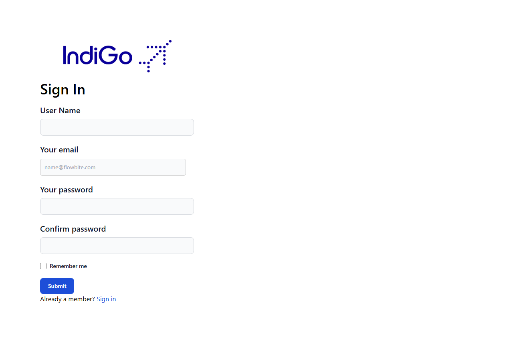
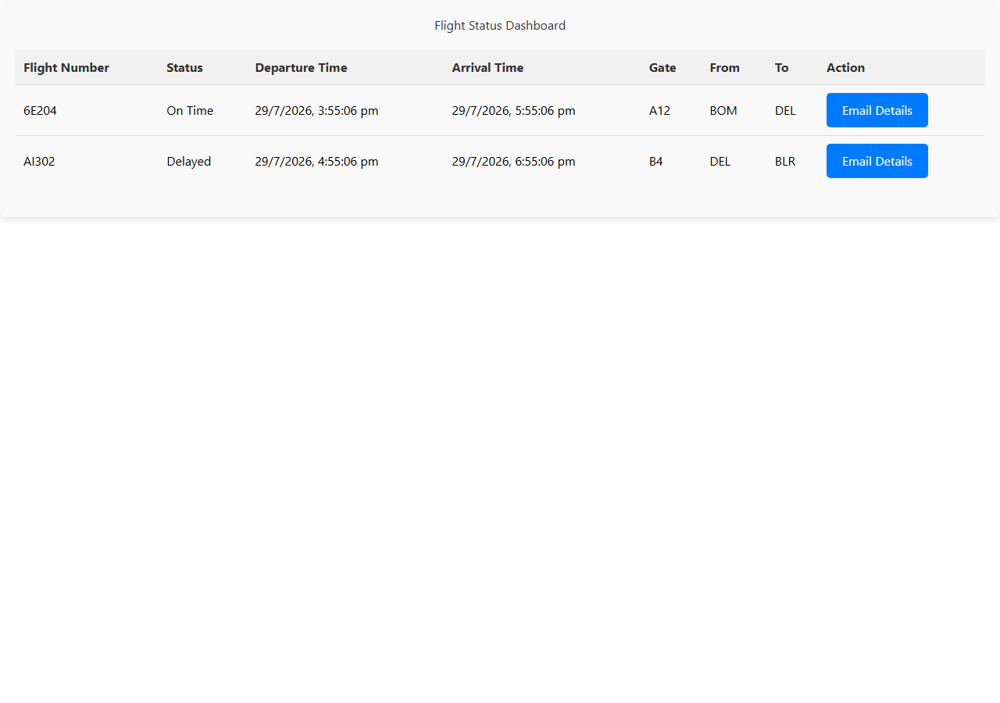

# HackHire — Flight Status & Notifications

A React/Flask app for tracking flight status and managing flight notification subscriptions.

## Overview

Register or log in, then view a live dashboard of flights with their status, gate, and departure/arrival times. Subscribe to notifications for specific flights (delivered via RabbitMQ), and manage notification preferences.

## Features

- Registration and login with hashed passwords
- Flight status dashboard (flight number, status, times, gate, route)
- Per-flight detail view
- Notification subscribe/unsubscribe, backed by RabbitMQ
- Notification preferences management

## Screenshots

| Sign In | Sign Up |
|---|---|
|  |  |

| Flight Status Dashboard |
|---|
|  |

## Technology Stack

**Frontend:** React 18, React Router 6, Tailwind CSS, Axios
**Backend:** Python, Flask, Flask-PyMongo, Flask-CORS, MongoDB, RabbitMQ (pika)

## Local Installation

Requires Node.js 18+, Python 3.10+, a MongoDB instance, and (for notification subscriptions) a running RabbitMQ instance.

```bash
git clone https://github.com/Rockstar100/HackHire.git
cd HackHire
```

### Backend

```bash
cd Backend
python -m venv venv
venv\Scripts\activate        # Windows
# source venv/bin/activate   # macOS/Linux
pip install -r requirements.txt
cp .env.example .env         # adjust MONGO_URI if needed
python app.py
```

### Frontend

```bash
npm install
npm start
```

Open [http://localhost:3000](http://localhost:3000), register an account, log in, and view the dashboard.

### Environment variables

**Backend/.env**

| Variable | Description | Default |
|---|---|---|
| `MONGO_URI` | MongoDB connection string | `mongodb://localhost:27017/flight_notifications` |
| `FLASK_DEBUG` | Enable Flask's debugger (never in production — exposes a remote code execution console) | `false` |

The frontend's API base URL (`http://127.0.0.1:5000`) is currently hardcoded rather than read from an environment variable.

## Available Commands

| Command | Description |
|---|---|
| `npm start` | Run the React app in development mode |
| `npm run build` | Build the React app for production |
| `python app.py` (Backend, with venv active) | Run the Flask API |

## Project Structure

```
HackHire/
├── src/
│   ├── components/
│   │   ├── LoginSignup/           # LoginForm, SignForm
│   │   ├── FlightStatusDashboard.jsx
│   │   ├── FlightDetail.jsx
│   │   ├── NotificationSubscription.jsx
│   │   └── NotificationsSettings.jsx
│   └── App.js                      # routes
└── Backend/
    ├── app.py                      # all Flask routes
    ├── utils.py                    # auth decorator, mock data helper
    └── requirements.txt
```

## API Reference

| Method | Route | Description |
|---|---|---|
| `GET` | `/api/flights` | List all flights |
| `POST` | `/api/signup` | Register (password hashed with werkzeug) |
| `POST` | `/api/login` | Log in |
| `GET`/`POST` | `/api/preferences/<user_id>` | Get/update notification preferences |
| `POST` | `/api/subscribe` | Subscribe to a flight's notifications (publishes to RabbitMQ) |
| `POST` | `/api/unsubscribe` | Unsubscribe from a flight |
| `GET` | `/api/subscriptions/<user_id>` | List a user's subscriptions |

## Deployment

Needs a persistent Python process, MongoDB, and RabbitMQ — not GitHub Pages material for the backend. Recommended: [Render](https://render.com) or [Railway](https://railway.app) for the Flask API + a managed MongoDB (Atlas) and RabbitMQ (CloudAMQP) instance. The React frontend can deploy separately to Vercel, Netlify, or GitHub Pages once its API URL is made configurable.

## Known Limitations

- No session/token-based auth beyond login — there's no JWT or session cookie, so `userId` is passed around client-side rather than derived from a verified credential on each request.
- The dashboard's "Email Details" button calls `/api/send-email`, which isn't implemented in the backend — clicking it will fail.
- The frontend's API base URL is hardcoded to `http://127.0.0.1:5000` rather than configurable via environment variable.
- `/api/subscribe` requires a running RabbitMQ instance; without one, subscribing to a flight will error.

## Future Improvements

- Add proper JWT-based auth instead of passing `userId` around unauthenticated.
- Implement or remove the `/api/send-email` feature.
- Make the frontend API base URL configurable.

## License

MIT — see [LICENSE](LICENSE).

## Author

**Parveen Jaiswal**
GitHub: [@Rockstar100](https://github.com/Rockstar100)
